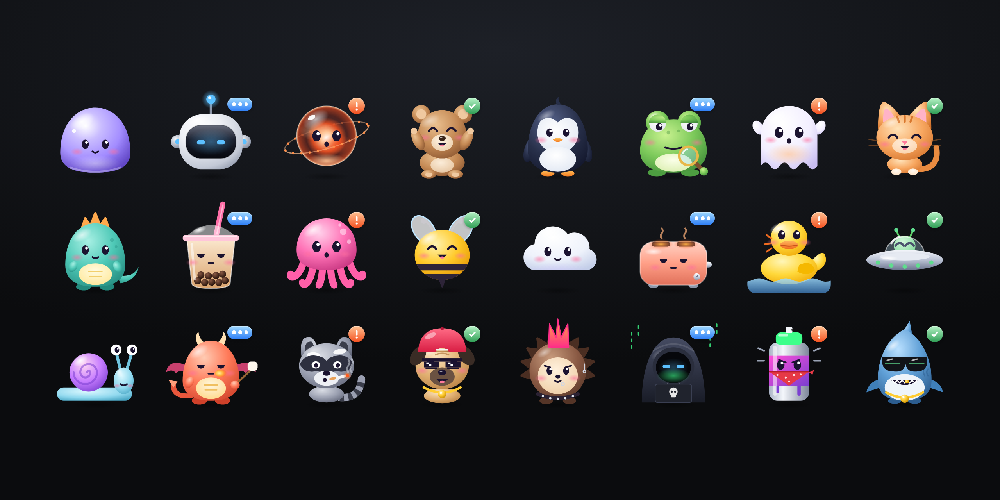

<div align="center">

# Zeeli Avatars

**Cute animated avatars for AI agents.** One zero-dependency web component, 24 characters, four states.

[](https://github.com/zeeli-dev/avatar-ai/actions/workflows/ci.yml)
[](https://www.npmjs.com/package/@zeeli/avatars)
[](scripts/size.mjs)
[](LICENSE)

[Docs and playground](https://zeeli-dev.github.io/avatar-ai/) · [Characters](#characters) · [API](#api) · [Contributing](CONTRIBUTING.md)



</div>

## Why

Agent tools show a lot of status: this sub-agent is thinking, that one needs approval, another just finished. Zeeli Avatars turns that status into a small character that bounces while it works, waves for your attention and celebrates when it is done. It reads at 16px in a sidebar and holds up at 200px in a hero.

- **One tag, any framework.** A native custom element: plain HTML, React 19, Vue, Svelte, Solid, Angular.
- **Zero dependencies, 22 kB gzipped** for all 24 characters.
- **Built for lists of agents.** 300 avatars at 28px hold 60fps. Offscreen avatars pause, and small sizes switch to a lighter mode on their own.
- **Accessible.** Each avatar has an accessible label, and `prefers-reduced-motion` turns it into a still image.
- **Typed.** TypeScript types, including the React JSX element.

## Install

```sh
pnpm add @zeeli/avatars    # or npm i / yarn add / bun add
```

## Usage

Import the package once. That registers `<agent-avatar>`.

```html
<script type="module">
  import '@zeeli/avatars';
</script>

<agent-avatar variant="teddy" state="working" size="40"></agent-avatar>
```

### React 19

```tsx
import '@zeeli/avatars';

export function AgentRow({ agent }) {
  return <agent-avatar variant={agent.avatar} state={agent.status} size={28} label={`${agent.name} is ${agent.status}`} />;
}
```

### Without a bundler

```html
<script type="module" src="https://cdn.jsdelivr.net/npm/@zeeli/avatars/src/index.js"></script>
```

## States

| State | Look | Use it for |
| --- | --- | --- |
| `idle` | Lavender, blinks and breathes | Waiting for work |
| `working` | Blue, typing dots, uses its prop | Running a task |
| `attention` | Orange, `!` badge | Needs input or approval |
| `done` | Green, check badge, sparkles | Finished |

Colors cross-fade when the state changes.

## Characters

| Set | Variants |
| --- | --- |
| Abstract | `mochi` gummy drop · `byte` ceramic robot · `orbit` glass orb |
| Characters | `teddy` bear with a laptop · `pip` penguin clerk · `kero` frog detective |
| Party crew | `boo` ghost · `neko` cat · `rex` dino builder · `boba` bubble tea · `octo` octopus · `buzz` bee |
| Wild bunch | `nimbus` cloud · `toasty` toaster · `quack` rubber duck · `zorp` UFO · `turbo` rocket snail · `ember` baby dragon |
| Edgy crew | `smokey` raccoon · `pugsy` pug · `spike` punk hedgehog · `glitch` hacker · `tagz` spray can · `chomp` shark |

Every character has its own idle, working, attention and done behavior. See them all in the [playground](https://zeeli-dev.github.io/avatar-ai/).

## API

### Attributes

| Attribute | Values | Default |
| --- | --- | --- |
| `variant` | Any name from the table above | `mochi` |
| `state` | `idle` · `working` · `attention` · `done` | `idle` |
| `size` | Number in px, or any CSS length. Numbers of 32 or less turn on lite mode. | `96px` |
| `label` | Accessible label | `Agent <state>` |

Style the host like any inline-block element. `--size` sets the size from CSS.

### Exports

```js
import { AgentAvatar, CHARACTERS, SETS, STATES, VARIANTS } from '@zeeli/avatars';

VARIANTS;                    // ['mochi', 'byte', ...]
CHARACTERS.rex.description;  // 'Tiny dino builder. ...'
SETS;                        // [{ id: 'abstract', title: 'Abstract' }, ...]
```

Importing in Node or during SSR is safe. The element only renders in the browser. React JSX types come from `@types/react`, an optional peer dependency.

## Performance

- Bounce, squash, shadow, badges and sparkles only animate `transform` and `opacity` on HTML layers, so the compositor runs them without repainting.
- No SVG filters. Glows and highlights are baked gradients.
- Only the current state animates. Hidden states run nothing.
- One shared `IntersectionObserver` pauses offscreen avatars.
- Lite mode (32px or smaller, or reduced motion) keeps idle avatars still and gives other states a single body motion.
- Stylesheets are shared per variant, and markup is cloned from a cached template.

## Browser support

Evergreen browsers with constructable stylesheets: Chrome and Edge 73+, Firefox 101+, Safari 16.4+.

## Contributing

New characters are very welcome. [CONTRIBUTING.md](CONTRIBUTING.md) covers the dev loop, the drawing rules and the checks each pull request must pass.

## License

[MIT](LICENSE). Created by Manno Beats for [Zeeli](https://zeeli.dev).
